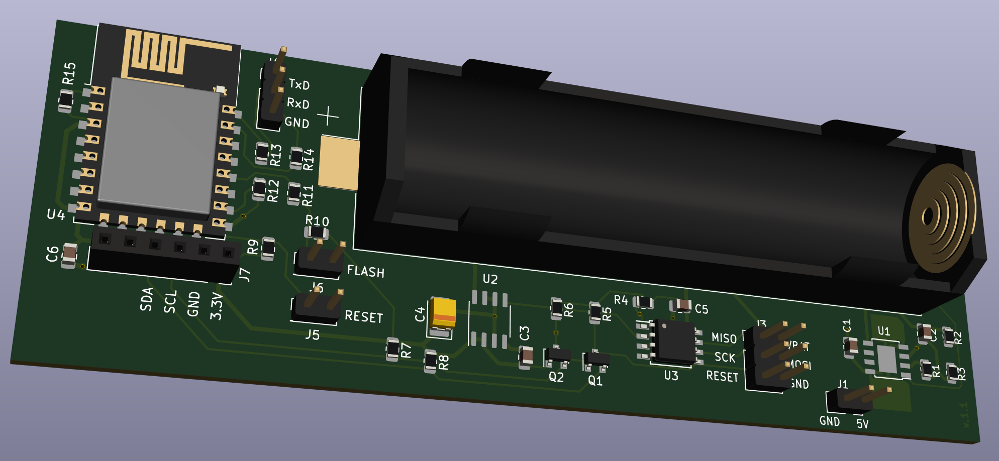
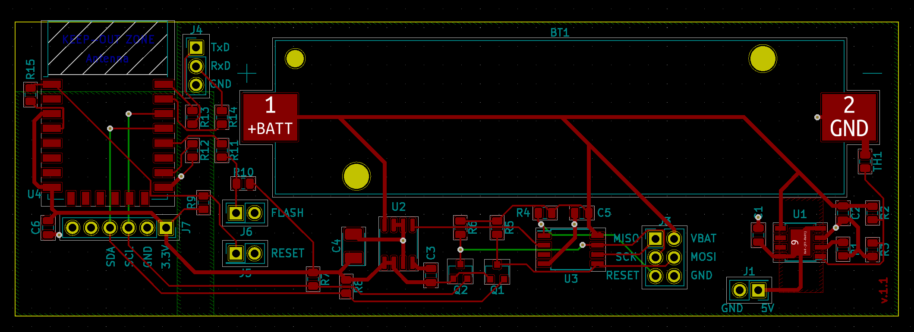
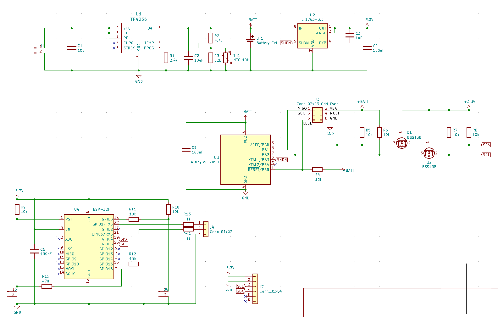

# PCB for IOT weather station

This is the PCB of my small IOT weather station. The weatherstation consists of the following parts:

- ATtiny85 and LT1763-3.3 for power control
- TP4056 to charge the li-ion battery with solar
- BME280 to measure temperature, humidity and pressure
- ESP8266 to connect to WiFi and send the reedings via MQTT

## pictures

